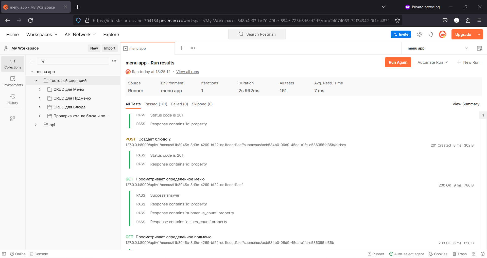

# Running with Docker Compose

If you have Docker Compose installed, you can run RestarauntAPI using the provided `docker-compose.yml` file. Follow these steps:

1. Clone the RestarauntAPI repository from GitHub.
2. Install Docker and Docker Compose if you haven't already.
3. Build Docker Compose containers using `docker-compose build`
4. Start the RestarauntAPI service using Docker Compose: `docker-compose up -d`
5. Access RestarauntAPI in your web browser at http://127.0.0.1:8000/docs.

To stop RestarauntAPI, run `docker-compose down`. This will stop and remove the containers created by Docker Compose.

# Applying migrations
1. Go inside RestarauntAPI container using 
`docker exec -it RESTARAUNT_API_CONTAINER_ID sh` command.
2. Apply migrations using `alembic upgrade head` command.

# Creating Docker Compose test containers
1. Build Docker Compose test containers using `docker-compose -f docker-compose_test.yml up`
2. Go inside RestarauntAPI test container using 
`docker exec -it RESTARAUNT_API_TEST_CONTAINER_ID sh` command.
3. Runing test using `pytest` command.

# Postman tests result

